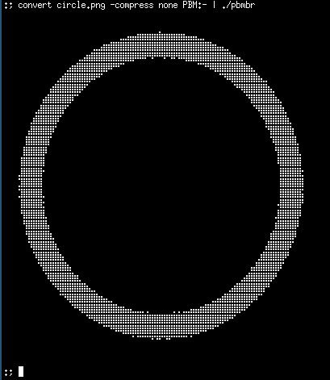
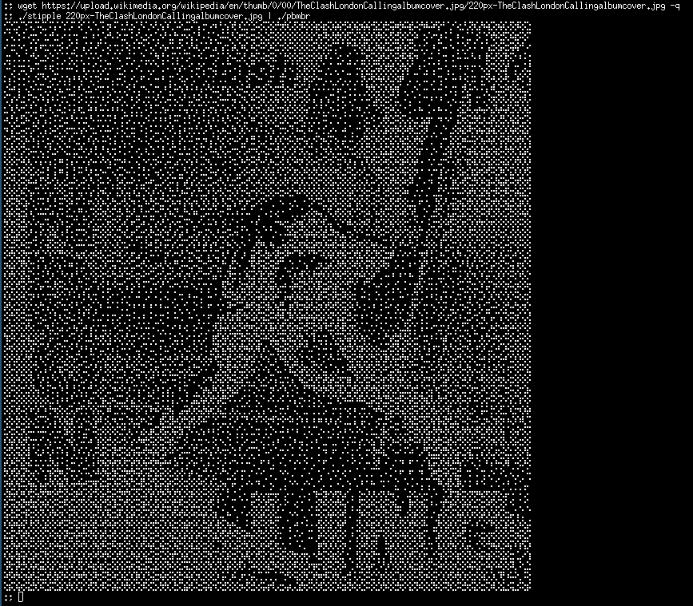

# Using Braille characters to Render Images in an Xterm

## Background

I use Xterm and I think it's quite pleasing to be able to render graphics
from the command line. Xterm is reasonably good at this and even supports
Sixel graphics: https://en.wikipedia.org/wiki/Sixel

Unfortunately, as well as Xterm, I'm almost always using Tmux
https://github.com/tmux/tmux/wiki and tmux just throws away Sixel codes.

To be fair, recent versions of Tmux do have support for Sixel graphics but,
given that I only really use Debian stable, there's a chance that won't
appear until we've all retired.

## Braille Characters

The Unicode character set contains a complete set of Braille characters 
which divide each character cell into eight squares, arranged as two 
columns and four rows. https://en.wikipedia.org/wiki/Braille_Patterns

I thought I'd write something to render the lowest common denominator 
graphics format https://en.wikipedia.org/wiki/Netpbm (Portable Bitmap) 
in these Braille characters. I expect this has been done multiple times 
and that if I looked hard enough at the Debian packages, there would 
be a utility. Where's the fun in that, though?

The idea is that portable bitmap format text can be piped into this utility 
and the resulting image appears in the terminal. It turns out that ImageMagick
(https://en.wikipedia.org/wiki/ImageMagick) is quite happy to write to stdout.

## Building

You can do this:

    gcc -Wall -Wextra pbmbr.c -o pbmbr 

Or simply:

    make pbmbr

If you prefer.

## Examples

This takes a PNG filer and uses ImageMagick convert to make a PBM and 
write that to stdout. The pbmbr program renders that.

    convert circle.png -compress none PBM:- | ./pbmbr

The result looks like this:

I've included a script called stipple which I found on the web. It attempts to 
convert an input file - which may be just a JPG - into a PBM. YMMV

    wget https://upload.wikimedia.org/wikipedia/en/thumb/0/00/TheClashLondonCallingalbumcover.jpg/220px-TheClashLondonCallingalbumcover.jpg -q
    ./stipple 220px-TheClashLondonCallingalbumcover.jpg | ./pbmb

Resulting in:

